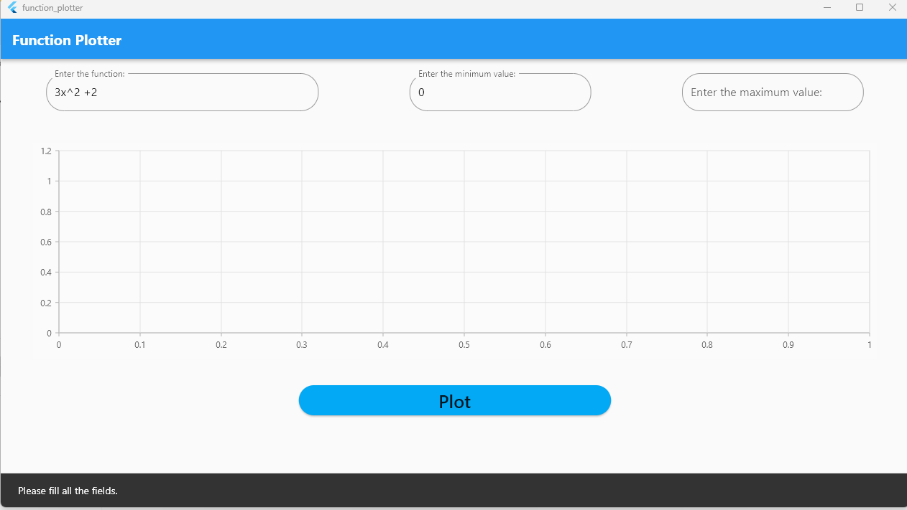

# function plotter
A Windows application that takes a string polynomial from the user , parse it and plot the equation
along the x range specified by the user.

## Test cases
1- Error meesage is viewed upon submission of empty fields

2-Invalid input function is not accepted
[alt text](https://github.com/Ahmedh12/function-plotter/blob/master/images/2.png?raw=true)
3-Valid function and range
[alt text](https://github.com/Ahmedh12/function-plotter/blob/master/images/3.png?raw=true)
## Authors

- [@Ahmed Hussien](https://www.github.com/Ahmedh12)

