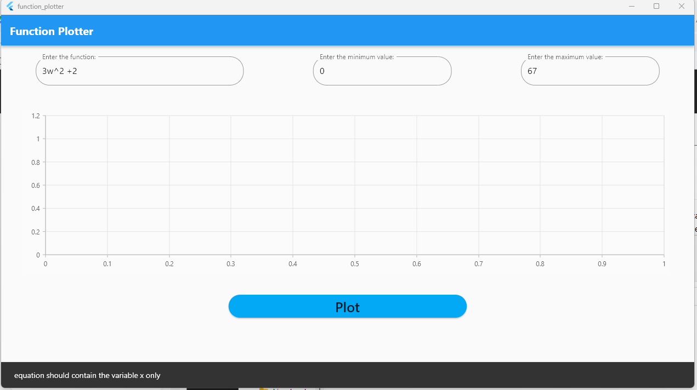
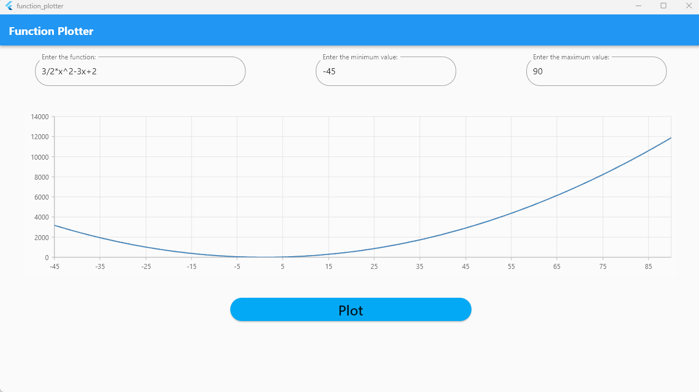

# function plotter
A Windows application that takes a string polynomial from the user , parse it and plot the equation
along the x range specified by the user.

## Test cases
### 1- Error meesage is viewed upon submission of empty fields

### 2-Invalid input function is not accepted

### 3-Valid function and range

## Authors

- [@Ahmed Hussien](https://www.github.com/Ahmedh12)

